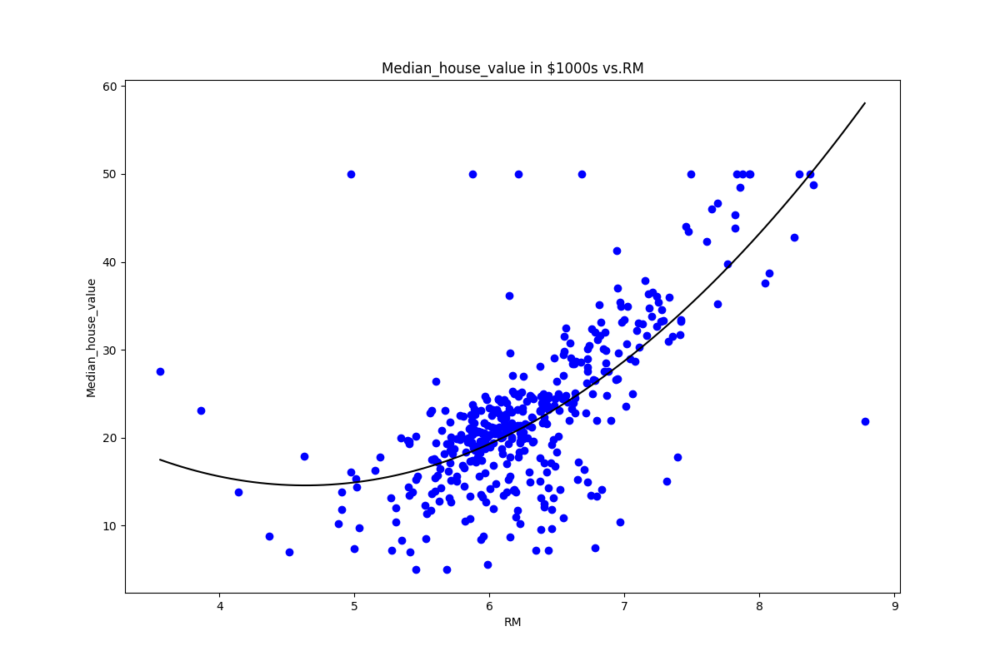

# Assignment1

In this assignment, we are to explore linear regression on the boston housing dataset. 

All of my python files that run the code required of part1, part2, and part3 and modules inside the package named 'package'. part1.py module handles and runs everything required of part1, part2.py module handles and runs everything required of part2, and part3.py module handles and runs everything required of part3. utility.py contains 2 methods, one for loading the boston housing dataset (make sure it is in same directory as the running script!), and another for viewing the correlation heatmap of the dataframe sent in. test.py simply runs the assignment requirements of part1, part2, and part3.

To test my work, one can simply go into a python shell by running python (make sure virtual environment is setup according to my requirements.txt), import package.test, and call package.test.test(). This will run the main methods of part1, part2, and part3, which covers everything required of assignment1. Make sure housing.csv is in the current directory in order for it to load properly.

Outside of the package, I have a main.py script which imports the package modules and runs the main methods of part1, part2, and part3, as well as some extra exploration that I did for part1 and part2 (I looped through all of the features individually and di Linear Regression and 2nd degree Polynomial Regression on each to test how well each feature does on predicted MEDV). The output of this main.py is shown in output.txt. 

Now, let me explain how I did each part of the assignment.

##Part1:
I decided to choose RM (average number of rooms per dwelling) as the feature due to its high correlation with MEDV.

First, I splitted the data into test and train set (0.80 : 0.20 ratio), trained the model using sklearn LinearRegression, and plotted the best fit line on the training data:

And on the test data:

As we can see from the output, the RMSE score is 6.38 and the R-squared score is 0.5877.

As an addition to part1, I also have a method called run_loop that loops through all of the features and trys the linear regression model on it to see how well it predicts MEDV. The main.py script runs this method (whole output can be seen in output.txt).

##Part2:
I use RM as the same feature to test polynomial regression (degree2). The difference is that we must generated a new dataframe with additional columns (feature^0 and feature^2). This can be done with PolynomialFeatures() and fit_transform(). After we obtained the desired 3-column data of powers of the feature, we do the same LinearRegression model and test and plot. The plot was a bit tricky, as we have to do some reshaping of input array in order to plot the best fit curve. The best fit curve on the training data is:

And the best fit curve on the test data is:

As we can see from the output, the RMSE score is 5.799 and the R-squared score is 0.6596.

Lastly, I modified my polyRegression method so that it can handle various degrees (just input the desired polynomial degree). So, this made testing with degree20 the same as degree2 (just input argument of 20.) The best fit curve (degree20) on the training data is:

And the best fit curve (degree20) on the test data is:

As we can see from the output, using RM as the feature and polynomial regression of degree20, the RMSE score is 5.489 and the R-squared score is 0.695.

##Part3:
This part is basically the same as part1, but we use multiple features (multiple columns to pass into as X_train for the model) instead of a single feature. I decided to choose 6 features that are highly correlated to MEDV: (INDUS, NOX, RM, TAX, PTRATIO, LSTAT). 

As we can see from the output, the RMSE score is 5.47, the R-squared score is 0.6968, and the adjusted R-sqaured score is 0.6922. 

Please see output.txt for thorough results and observations made regarding each model. To summarize, multiple regression with the chosen 6 features performed the best, and the adjusted r2 score is very similar to the r2 score which suggests these 6 features are all important. Polynomial regression of degree2 performed the best when RM is selected as the feature. When testing polynomial regression of degree20, the model performs better than with degree2; however, the curve definitely seems like an overfit on the data and would probably perform worse on data that is not seen yet. Lastly, simple linear regression performs the worst (to not much suprise), and the best feature to choose is RM.

