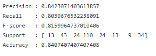
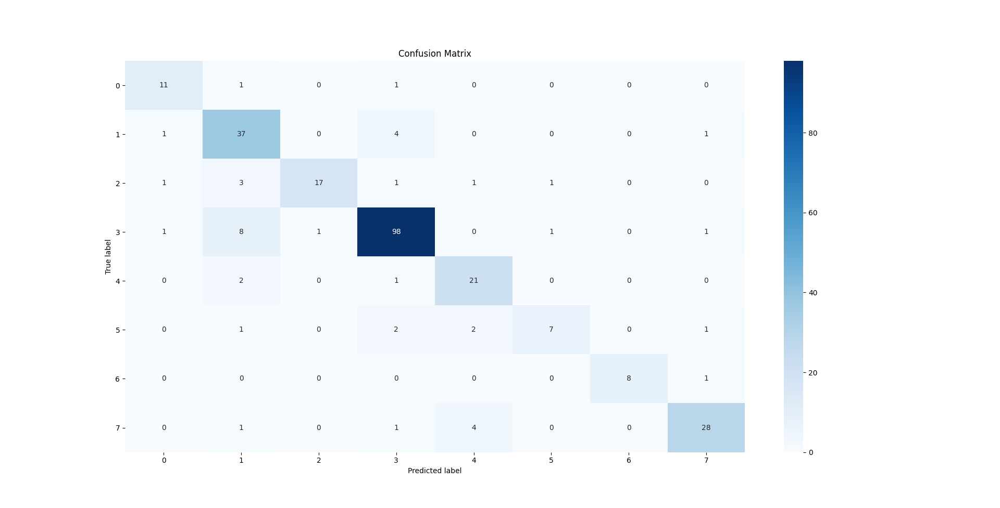

 # Assignment 2

In this assignment, you will be building a SVM classifier to label [famous people's images](https://scikit-learn.org/stable/auto_examples/applications/plot_face_recognition.html#sphx-glr-auto-examples-applications-plot-face-recognition-py).

## Dataset

You will use the labeled faces in the [Wild dataset](https://www.kaggle.com/c/labeled-faces-in-the-wild/overview) which consists of several thousand collated photos of the various public figures.

```python
from sklearn.datasets import fetch_lfw_people

def load_data():
    faces = fetch_lfw_people(min_faces_per_person=60)
    print('data loaded')
    print(faces.target_names)
    print(faces.images_shape)
```

## Requirements

Each image contains [62x47] or nearly 3,000 pixels. Use each pixel value as a feature. You will use RandomizedPCA to extract 150 fundamental components to feed into your SVM model as a single pipeline.

```python
from sklearn.svm import SVC
from sklearn.decomposition import RandomizedPCA
from sklearn.pipeline import make_pipeline

pca = RandomizedPCA(n_components=150, whiten=True, random_state=42)
svc = SVC(kernel='rbf', class_weight='balanced')
model = make_pipeline(pca, svc)
```

1. Split the data into a training and testing set.

2. Use a [grid search](https://scikit-learn.org/stable/modules/generated/sklearn.model_selection.GridSearchCV.html) cross-validation to explore combinations of [parameters](https://scikit-learn.org/stable/modules/grid_search.html#grid-search) to determine the best model: 
   - C: margin hardness E.g. [1, 5, 10, 50]
   - gama: radial basis function kernel E.g. [0.0001, 0.0005, 0.001, 0.005]
 * precision 
 * recall
 * f1-score
 * support

 3. Draw a 4x6 subplots of images using names as label with color black for correct instances and red for incorrect instances.

 4. Draw a confusion matrix between features in a [heatmap](https://seaborn.pydata.org/generated/seaborn.heatmap.html) with X-axis of 'Actual' and Y-axis of 'Predicted'.

 ----------------------

 # Student Notes

 For this assignment, we are to explore the Labeled Faces in the Wild (LFW) dataset and try to build an accurate rbf SVC classifier model on the imported data. 
 
 As explained above, each image is 62x47, and thus with each pixel value as a feature, there are nearly 3000 features. Thus, we will use RandomizedPCA to extract 150 fundamental components before we feed this transformed data into our SVM model as a single pipeline. 

 We will also explore how to do grid search cross validation to explore combinations of parameters in order to determine the best C and gamma values for our rbf kernel SVC classifier for this particular PCA transformed image dataset.

 At the end, we will print out our scores, a 4x6 subplots of images using names as label with color black for correct instances and red for incorrect instances, as well as a confusion matrix heatmap for our test data results.

 Now, let me walkthrough my exploration and solution for this assignment 2.

 I mainly did the work in jupyter notebook before implementing the solution as a standalone program in python. 

 I first loaded the data with the argument min_faces_per_person=60 so that only people with at least 60 images in the dataset are kept. I then analyzed the shape of the image data as well as the target data. 
 
 As we can see from assignment2_output.txt (which is generated as an output file when running my py file), with this argument, there are 7 people kept : ['Ariel Sharon' 'Colin Powell' 'Donald Rumsfeld' 'George W Bush' 'Gerhard Schroeder' 'Hugo Chavez' 'Junichiro Koizumi' 'Tony Blair'].

 The shape of the image data is (1348, 2914), the data values range from 0-255, and the data values of the label data range from 0-7 (each representing one of the people above.) So, we understand that there are 1348 samples imported, and 2914 pixel features.

 In the jupyter notebook, I proceeded with the plotting of some of the images as well as their labels, just to take a look at the images. We also see that there is only a single color channel (image averaged to a single gray level channel). I then plot 4x6 subplots of random images chosen from the data set. This image is shown below:


Now that I have correctly loaded in our data, I now split the data into train and test set with 80:20 ratio.

I then normalize the train and test data via simply dividing by 255 to ensure that each input vector of X it [0,1].

Now, I build the model pipeline with RandomizedPCA and rbf SVM model. We will use RandomizedPCA to extract 150 fundamental components (from the near 3000 pixel features) as step 1 of the pipeline. As step 2 of our pipeline we will have a rbf SVM model. 

Next, with grid search cross-validation, I explore different combinations of C and gamma parameters to determine the best parameters for our pipeline model. The parameter grid that I configured is shown below:


From grid search cross-validation, the best parameters are shown:

Best parameter (CV score=0.8377):

{'svc__C': 10, 'svc__gamma': 0.001}

With C=10 and gamma=0.001, the cross validation score was 83.77%.

Afterwards, I then set the model pipeline's SVC params with best params as found by grid search, and fit the model pipeline (PCA and rbf SVC) with training data/label to train the model.

I make the predictions on the training set, and print out the classification report as well as the accuracy scores:



As we can see, our model performs quite well on the test data, with overall accuracy of 84% and around the same precision, recall, and F1-score (84% precision, 80% recall, 81.5% F1). This is quite good because we have used PCA to reduce dimensionality from around 3000 features to 150 features, and so some information is bound to be lost. Also, we are just using a simple rbf kernel SVC classifier with nothing too fancy, so a 84% classification accuracy is really good considering this!

Finally, to check our test results, I plot 24 random test images as 4x6 subplots. The title of the image is the true label, and red text indicates that this label has been misclassified by our model; black text indicates correct classification.


In this random program run, we see that only 2 images out of the 24 randomly selected images were misclassfied (a noncentered image of George W Bush and an image of Donald Rumsfeld).

And lastly, I plot the confusion matrix heatmap for our test data results.



The Label number corresponds to index of people list
0-Ariel Sharon,
1-Colin Powell,
2-Donald Rumsfeld,
3-George W Bush,
4-Gerhard Schroeder,
5-Hugo Chavez,
6-Junichiro Koizumi,
7-Tony Blair

Assignment2.ipynb is my jupyter notebook with all the requirements of the assignment as well as some further exploration done by me.

assignment2.py is my python file with a defined class PeopleImageClassifier that contains all the methods needed from importing the data, exploring the data, plotting the data images, splitting the data, building the model pipeline, grid searching for best parameters, training the model, making predictions, printing the classification report and scores, plotting the test images, and plotting the confusion matrix heatmap. With all the functionality in the class methods, the main method is very clean and refactored.

Running assignment2.py generates the output seen in assignment2_output.txt, as well as the required images (4x6 subplots of imported data images [not required],4x6 subplots of test images using names as label with color black for correct instances and red for incorrect instances, and confusion matrix of test results).

See my assignment2_output.txt for quick summary of what my python program is doing and the output.

See my assignment2.py python file and Assignment2.ipynb jupyter notebook file for specifics on implementation as well as further explorations.

