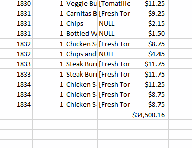
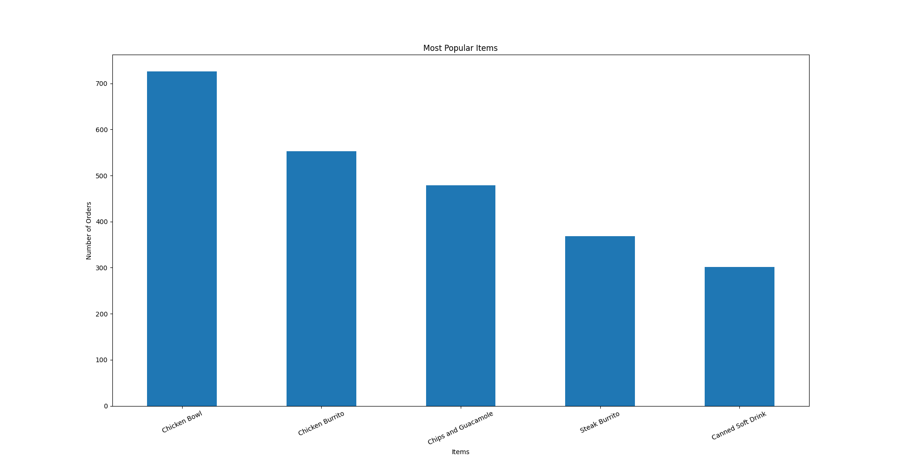
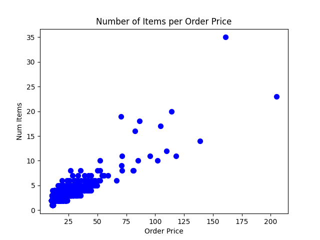

# Lab 1

Basic data manipulation using Pandas and Numpy libraries.

Check out [Chipotle Exercises Video Tutorial](https://www.youtube.com/watch?v=lpuYZ5EUyS8&list=PLgJhDSE2ZLxaY_DigHeiIDC1cD09rXgJv&index=2) to watch a data scientist go through the exercises

We will be using [data/chipotle.tsv] in the lab 1.


## Install Dependency

We will be using [pipenv](https://realpython.com/pipenv-guide/) to manage dependencies. Run this command to install required dependencies.

```
pipenv install -r requirements.txt
```


Let's implement all ##TODO functions in lab1.py.

## To Run the lab 1

```
pipenv shell
python lab1.py | tee lab1_output.txt
```

-------

### Student Notes
I believe that there are some incorrect values for some of the assertions in the test function. First, for "assert quantity," I believe that it should be 761 and not 159 because the most popular item is the Chicken Bowl and the sum of all of its quantity totals to 761. Next, I believe that the total sales should be 34500.16, and not 39237.02 since totaling all of the prices should give 34500.16 (I even checked with excel sheet autosum function):



As a result, the average sales amount per order should be 34500.16 / 1834 = 18.81. 

I have made these changes in the test function to allow assertions to pass. In the lab folder, I have also included the bar plot and scatter plot results of the assignment.





